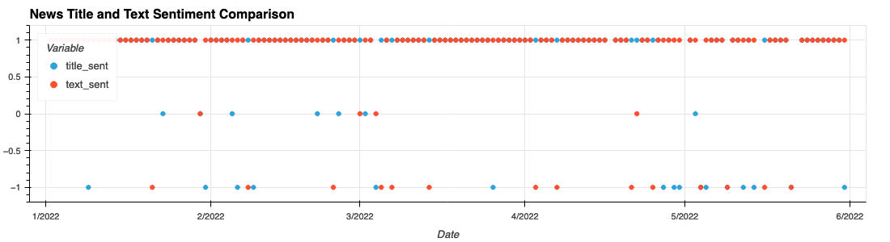
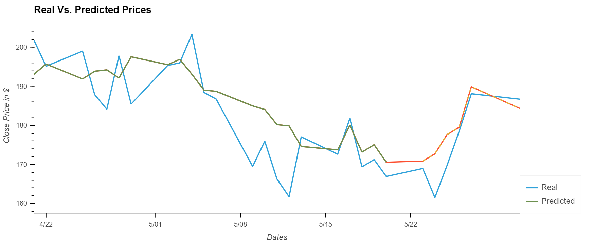

# Stock Movement Prediction - Natural Language Processing (NLP)

Due to increased volatility in the current market landscape, our group's objective will be to utilize nlp sentiment analysis in order to predict future stock movements. We will use deep learning recurrent neural networks to model future price movements for various stocks and decipher whether or not the inclusion of nlp sentiment provided additional accuracy or precision.

Source for getting news sentiment scores:

- News APIs (Polygon.io)

Some stocks/indices/etfs that have been shortlisted based on the initial discussion:

- ARKK / TSLA / AMZN / JNJ / XOM / NVDA

## Project Description

1) Our first step included collecting news data using [Polygon.io's Ticker News API](https://polygon.io/docs/stocks/get_v2_reference_news) as well as getting the daily close prices relates to our selected stocks above.
    * Close prices were collected manually from [Yahoo Finance](https://finance.yahoo.com/) and inserted as a CSV.
    * We chose to use this Ticker News API because of its flexibility of usage and lack of time restraints compared to other APIs.
        * The text related to the news API consisted of the first two sentences of the article

2) We then calculated the sentiment scores of the title and text and took a compounded sum of the scores. With this information we will take the close cost and the score to determine a trend impact and visualize.
    * Determined correlations between title, text, and cost sentiment score
    
    
    
    
    * Created wordclouds to determine most popular words in title
    
    

3) Next our group trained the model to be able to determine predicted stock prices based on the sentiment values of the title
    * Used the title compunded score 
    * Tinkered with adjusting the window size to get predicted data that best represented the the real prices
    * Our final goal was to extend our predicted data based out 10 days to get an estimation for what these prices would like
    

## Collaborators
* Kamalnivas Balasubramanian
* John Ryan
* Alyssa Younger
* Patricia Rajamanickam

## Installation Guide
- ### Must have Anaconda base ###
```
conda activate base
conda create -n pyvizenv python=3.7 -y
conda activate pyvizenv
conda install -c conda-forge python-dotenv -y
conda install -c anaconda nb_conda -y
conda install -c conda-forge nodejs=12 -y
conda install -c pyviz holoviz -y
conda install -c plotly plotly -y
conda install -c conda-forge jupyterlab=2.2 -y
conda install -c anaconda numpy==1.19 -y
conda install -c conda-forge matplotlib==3.0.3 -y
conda install -c anaconda pathlib -y
conda install -c anaconda ipywidgets
conda install -c conda-forge tensorflow
conda install -c conda-forge imbalanced-learn
conda install -c conda-forge wordcloud
conda install -c conda-forge spacy
python -m spacy download en_core_web_sm
python -c "import nltk;nltk.download('all')"
conda create -n algotrading python=3.7 anaconda

```

- #### Fetching the news from the polygon API:
    - Create a polygon API & store the polygon public API in the .env
    - Usage: python download_news.py
    - The script array needs to be modified to fetch older news / other tickers.
